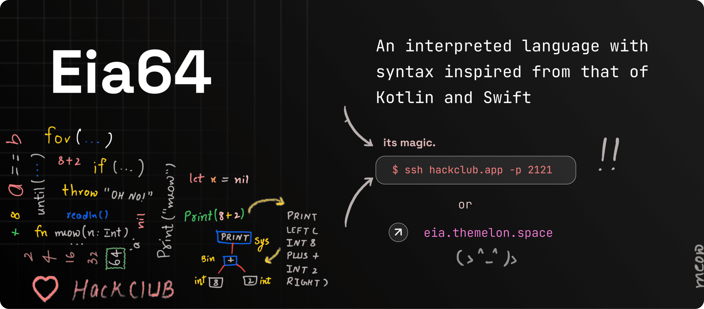
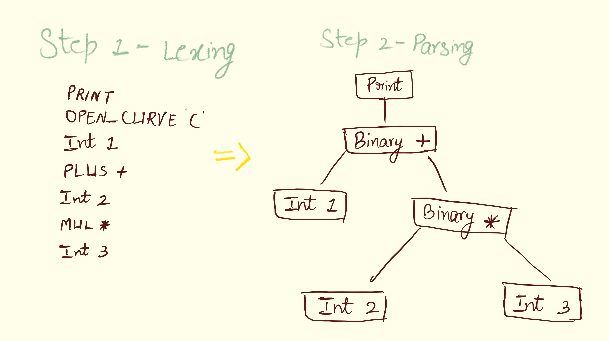
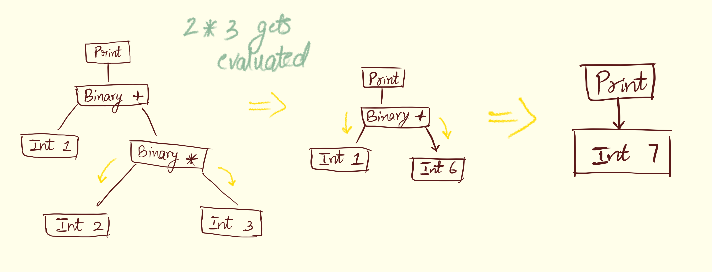

# A New Programming Language — Eia64




SSH into `hackckub.app`

````shell
ssh hackclub.app -p 2121
````
Or try Eia-Playground — [eia.themelon.space]()

## Highlights ✨

- Supports <b>`String`, `Int`, `Bool`, `Float`, `Array`, `List`</b>
- **Functions**, **Variables**, **Lambdas** ✌️
- **Object-oriented**: Creating **Classes** and **Objects** ☕
- Automatic type resolution — who specifies variable types nowadays? (maybe Java does)
- Comes with a **Standard Library** 📚
- Debug your code with **Live Tracer** 💪


## How he works

Eia64 is an interpreted language ✨



