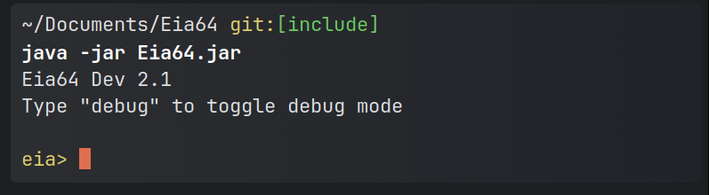
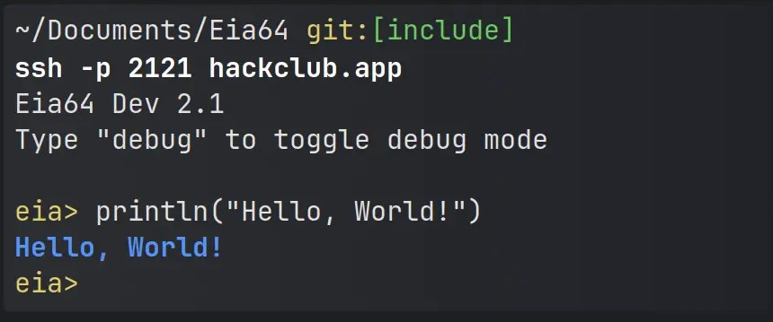

# Eia64

Eia64 is an interpreted language that draws inspiration from the lovely syntax of Kotlin and many other languages like Go.

## Main highlights

- Standard library
- Importing external classes
- Class structure for object support
- Emphasis on strict typing
- Mutable / Immutable variables
- Functions and overloading
- Access modifiers
- Anonymous Lambdas
- Decent support for tracing errors along with try-catch
- Live trace ability — see how your code flows while it runs

## Quick start

- Requires minimum Java version 11

```bash
git clone https://github.com/XomaDev/Eia64
cd Eia64 && java -jar Eia64.jar
```

and tada! You have a fully interactive shell



## You lazy?

If you are afraid of Git, you can try out our SSH version! 👀

```shell
ssh -p 2121 hackclub.app
```

and look what you got! You can try out Eia without installing it. 😎



It's hosted on [Nest](https://github.com/hackclub/nest) by HackClub <b><3</b>

You can find all the docs at [eia-docs.vercel.app](https://eia-docs.vercel.app)

## Links

- Eia SSH server: [XomaDev/EiaAPI](https://github/XomaDev/EiaAPI)
- Eia docs: [XomaDev/Eia-Docs](https://github/XomaDev/eia-docs)